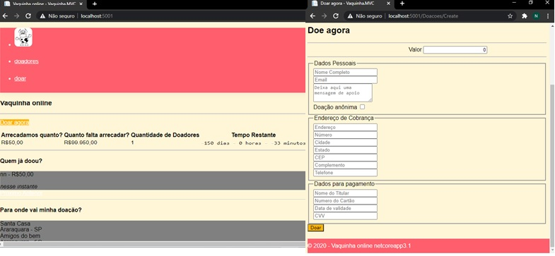

# dotnet-vaquinha-tests
Projeto Base para Testes - .Net Core  
[Implementação baseada em Crowdfunding - implementa:] (https://vaquinha.azurewebsites.net)
### OpenQA.Selenium -> webdriver
### Xunit -> ferramenta de teste
### Moq -> emula determinado componente
### Fluent Assertions -> documentar melhor o teste
### Fake -> gera dados aleatórios válidos

## Digital Innovation One

[Clique aqui para se inscrever na Digital Innovation One](https://digitalinnovation.one/sign-up?ref=H395IYS4Z6)  

##### Browser print screen

    

##Criadores:
## Eliézer Zarpelão
[GitHub Timeline](https://elizarp.github.io/timeline/)  
[Linkedin](http://br.linkedin.com/in/eliezerzarpelao)  
[Github](https://github.com/elizarp) 

## Marcos Freire
[Linkedin](https://www.linkedin.com/in/marcos-freire-a73891125/)  
[Github](https://github.com/marcosfreire) 

## Slides
[Slides em PDF](TesteNetCore.pdf)